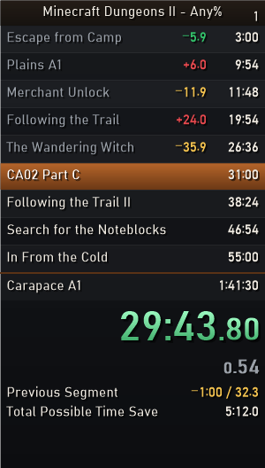

# MCD2 Autosplitter

LiveSplit autosplitter and load remover for **Minecraft Dungeons II** on PC (Steam or Xbox app).

### [⬇ Download the latest version](https://github.com/Fylexxy/mcd2-autosplitter/releases/latest/download/MCD2-Autosplitter.zip)

**what it does**
- timer starts when you load into the world from the menu
- loading screens pause the game time
- splits every time you finish a relevant main quest
- reset and the last split you do yourself

**setup**
1. unzip MCD2-Autosplitter.zip
2. download [asl-help](https://github.com/just-ero/asl-help/raw/main/lib/asl-help)
3. put asl-help and MinecraftDungeonsII.asl in your LiveSplit\Components folder
4. open livesplit, right click > Open Layout > From File > MCD2.lsl
5. right click > Open Splits > From File > MCD2 Any%.lss
6. if it asks to switch to game time click yes

You can turn single quest splits on or off in Edit Layout > Layout Settings > Scriptable Auto Splitter.

 

**faq**

*Is it safe?* It only reads the game's memory. No mods, no changed game files.

*Xbox app?* Should work the same, but nobody tested it yet. If you try it, let me know!

*Times in the picture?* Just example times to show the layout.

**problems**

If something breaks please dm "Fylexxy" on discord or make an [issue](https://github.com/Fylexxy/mcd2-autosplitter/issues) on github.
